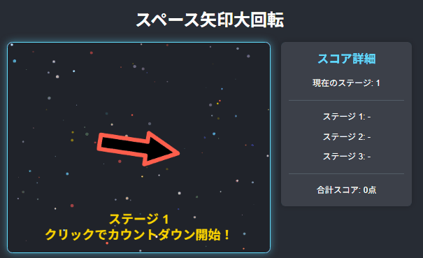

# スペース矢印大回転

## 公開ページ
[https://keigox68000.github.io/RollingArrow/](https://keigox68000.github.io/RollingArrow/)

## これはなに？
回転する虹色の矢印をタイミング良く止めるスコアアタックゲーム  
完全マウスオペレーション  

## ルール
- 矢印が画面中央で回転します。ステージが進むと回転速度が上がります。
- マウスの左クリックで回転する矢印を止めます。
- 矢印が真上を向いていると180点、真下だと0点。角度によって点数が変わります。
- 全3ステージで、合計点を競います。
- ステージ1の開始前のみ、3秒間のカウントダウンがあります。（数字は矢印上に表示）
- ステージ2と3は、結果表示後のクリックで即座に開始します。
- ゲームオーバー後、5秒経過するかクリックすると初期画面に戻り再挑戦できます。

Good Luck!